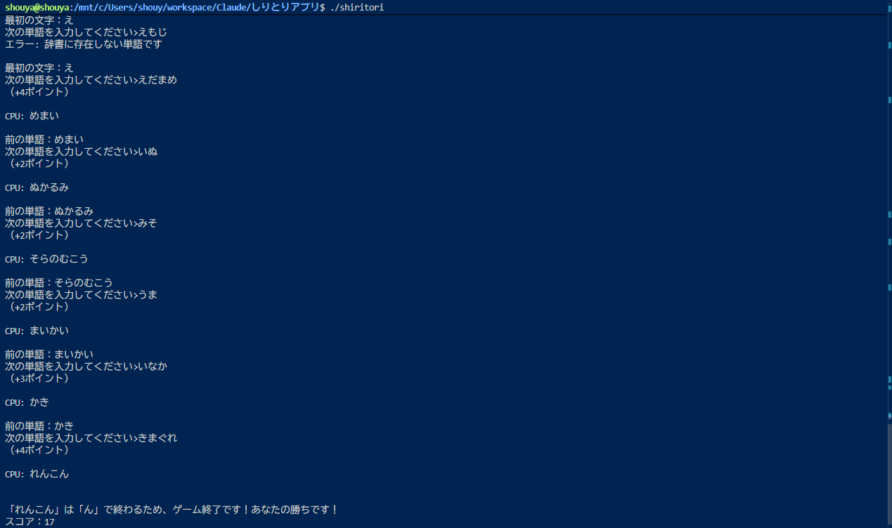

# しりとりアプリ

jig.jp サマーインターンシップ（SABERAコース）選考課題の提出物です。  
プレイヤーとCPUが交互に単語をつなぐしりとりゲームをC言語で実装しました。

## 動作環境

| 項目 | 内容 |
|---|---|
| OS | Ubuntu（WSL2 on Windows / macOS 対応） |
| コンパイラ | gcc 11.4.0 以上（clang 可） |
| 文字コード | UTF-8 |

## ビルド方法・実行方法

```bash
# 通常ビルド
gcc shiritori.c -o shiritori && ./shiritori

# 警告を有効にしてビルド（推奨）
gcc -Wall -Wextra shiritori.c -o shiritori && ./shiritori
```

> `shiritori.c` と `dictionary.txt` を同じディレクトリに置いた状態で実行してください。

## 動作のスクリーンショット



## 実装した機能

### 必須機能

#### 直前の単語の表示
ゲーム開始時はランダムに決まった最初の文字を表示し、以降は直前に入力された（またはCPUが返した）単語を表示します。

#### 任意の単語の入力・しりとり判定
入力された単語の先頭と直前の単語の末尾を比較します。一致した場合のみ単語を更新し、不一致の場合はエラーを表示します。UTF-8ではひらがなが3バイトで表されるため、`strncmp` で先頭・末尾それぞれ3バイトを比較しています。

#### 「ん」終了
入力した単語の末尾が「ん」（UTF-8: `0xE3 0x82 0x93`）だった場合、ゲームを終了します。

#### 重複単語の終了
履歴配列（最大200語）を線形探索し、過去に使用された単語が入力された場合はゲームを終了します。

#### リセット機能
- **ゲーム中**：`reset` と入力することでいつでも最初からやり直せます
- **ゲーム終了後**：「もう一度遊びますか？ (y/n)」が表示され、`y` で再スタートできます

---

### 追加機能（必須要件を超えた独自実装）

#### ランダムな開始文字
毎回同じ文字から始まると単調になるため、あ行〜わ行の中からランダムに最初の文字が決まるようにしました。`rand()` と `srand(time(NULL))` を使用しています。

#### ひらがな制限・長音符対応
ひらがな・長音符（ー）のみ入力を受け付け、英数字やカタカナは弾きます。`is_hiragana_only` 関数を実装し、UTF-8のひらがな範囲を3バイト単位で検査します。長音符「ー」（`0xE3 0x83 0xBC`）はひらがな範囲外のため例外処理として許可しています。

#### 辞書チェック
辞書未収録の単語を入力できないよう、`dictionary.txt`（約4400語）に存在する単語のみ受け付けます。ゲームのたびにファイルを開いて線形探索する実装です。辞書には一般名詞・動植物名・国名・苗字など幅広い語彙を収録しています。辞書の語彙は内容を確認・取捨選択しながら整備しました。

#### CPU対戦
入力のたびにCPUが自動で返答する対戦形式にすることで、ゲームにリズムと緊張感を持たせました。辞書から直前の単語の末尾に続く候補を収集してランダムに選択します。候補が0件（CPUが詰んだ状態）・「ん」終わり・重複単語のいずれもプレイヤーの勝ちとして処理しています。

#### スコア機能
長い単語ほど難しいためスコアが高くなる仕様にしました。入力した単語のひらがな文字数（バイト数÷3）がそのままポイントになり、ゲーム終了時に合計スコアを表示します。

## 既知の制限事項

- 辞書に収録されていない単語は使用不可（固有名詞・新語など）
- 「ー」で終わる単語をCPUが選んだ場合、次に繋げる単語がなく詰む可能性がある
- 履歴の上限は200語（超過した場合はゲーム終了）

## 参考にしたWebサイト

- [cppreference.com - C standard library](https://en.cppreference.com/w/c)  
  `fgets`・`strcmp`・`strncmp`・`rand` などの関数仕様の確認に使用
- [Unicode Chart - Hiragana (U+3040–U+309F)](https://www.unicode.org/charts/PDF/U3040.pdf)  
  ひらがなのUnicodeコードポイント範囲とUTF-8バイト表現の確認に使用
- jig.jp 配布の課題資料  
  しりとりの基本実装手順・UTF-8処理の解説を参照

## AIの活用方法

このプロジェクトでは **Claude Code（Anthropic）** を活用しました。

| 活用箇所 | 自分がやったこと・AIをどう使ったか |
|---|---|
| CPU対戦機能の設計 | `cpu_reply` 関数の設計方針をAIと議論し、自分でロジックを考えて実装した |
| UTF-8処理 | ひらがな判定・「ん」判定・「ー」対応のバイト演算をAIに質問しながら理解し、自分でコードを書いた |
| バグ修正 | 変数名ミス・型の不一致・バッファオーバーフローなど、自分で書いたコードのバグをAIに指摘してもらい、自分で修正した |
| 辞書の拡充 | AIに単語リストの生成を補助してもらい、自分で内容を確認・取捨選択して4400語以上に整備した |
| C言語の疑問解消 | `size_t` vs `int`・2次元配列の扱い・`const char *` の意味など、C言語特有の挙動を自分で調べ、理解できない部分をAIに質問した |

コードの実装・デバッグ・Git操作はすべて自分で行い、AIは「疑問への回答」「バグの指摘」「辞書データ生成の補助」の役割で活用しました。この課題を通じて、UTF-8の文字コード処理やCの文字列操作、ファイルI/Oの基礎を実践的に理解できました。
